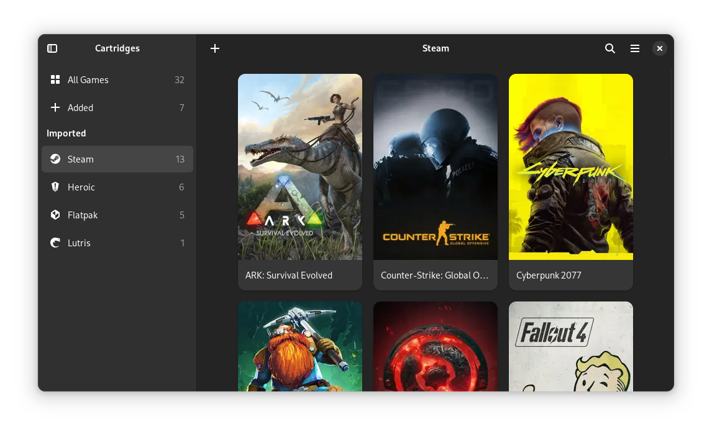

> [!CAUTION]
> This project is in **alpha** and still in development.

> [!WARNING]
> This project uses AI. See [Contributing](CONTRIBUTING.md#speckit-workflow) for more info.

<div align="center">
  

  # Cartridges

  A GTK4 + Libadwaita game launcher

  
</div>

# The Project

Cartridges is an easy-to-use, elegant game launcher written in Python using GTK4 and Libadwaita.

## Features

- Manually adding and editing games
- Importing games from various sources:
  - Steam
  - Lutris
  - Heroic
  - Bottles
  - itch
  - Legendary
  - RetroArch
  - Flatpak
  - Desktop Entries
- Filtering games by source
- Searching and sorting by title, date added and last played
- Hiding games
- Download cover art from [SteamGridDB](https://www.steamgriddb.com/)
- Searching for games on various databases
- Animated covers
- A search provider for GNOME

# Installation

## Linux

Nightly [releases](https://github.com/SamuelM333/cartridges/releases) are available.

```sh
flatpak install page.samuelm333.Cartridges.flatpak
```

## Building manually

See [Building](CONTRIBUTING.md#building).

# Contributing

See [CONTRIBUTING.md](CONTRIBUTING.md).

Thanks to [Weblate](https://weblate.org/) for hosting our translations!

# Acknowledgements

Fork of https://codeberg.org/kramo/cartridges

The Steam source uses code from Solstice Game Studios’ [fork](https://github.com/solsticegamestudios/vdf) of vdf, licensed under [MIT](https://github.com/solsticegamestudios/vdf/blob/be1f7220238022f8b29fe747f0b643f280bfdb6e/LICENSE).
